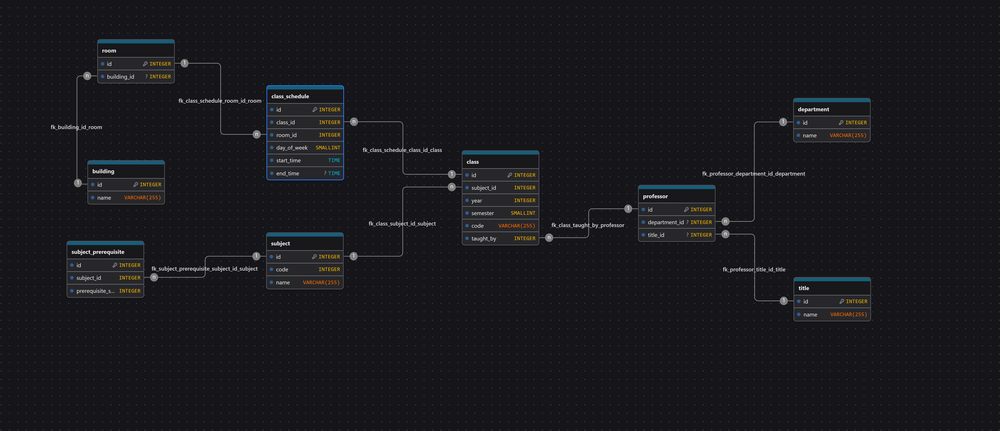

# Desafio Técnico - Relatórios da Escolinha

Este projeto foi criado como parte de um desafio técnico para a vaga de Desenvolvedor Java Pleno. O objetivo é desenvolver uma API REST que forneça relatórios essenciais para a nova gestão da "Escolinha", liderada pelo Professor Girafales.

A API permite consultar:
- A quantidade de horas semanais comprometidas por cada professor.
- A grade de horários ocupados e livres das salas de aula.

A aplicação foi desenvolvida com **Java 21**, **Spring Boot**, **JPA/Hibernate** e **PostgreSQL**. O ambiente é totalmente gerenciado com **Docker** e as migrações de banco de dados são controladas pelo **Flyway**, garantindo que qualquer pessoa possa executar o projeto com um único comando.

---

# Índice

1.  [Análise e Adaptação do Modelo de Dados](#análise-e-adaptação-do-modelo-de-dados)
2.  [Respondendo ao Desafio](#respondendo-ao-desafio)
3.  [Simplicidade e Foco no Desafio](#simplicidade-e-foco-no-desafio)
4.  [Escolhas Técnicas](#escolhas-técnicas)
5.  [Requisitos de Ambiente](#requisitos-de-ambiente)
6.  [Instruções para Execução](#instruções-para-execução)
7.  [Descrição das Rotas da API](#descrição-das-rotas-da-api)
8.  [Estrutura de Pastas](#estrutura-de-pastas)

---

## Análise e Adaptação do Modelo de Dados

O modelo de dados é a fundação de qualquer sistema. O diagrama ER fornecido no desafio serviu como um ponto de partida conceitual, mas uma análise detalhada revelou inconsistências lógicas que impediam a criação de um schema de banco de dados funcional e coerente.

Para viabilizar o desenvolvimento, foi necessário interpretar e corrigir esses pontos. As principais questões levantadas no diagrama original e as soluções aplicadas no modelo final são detalhadas abaixo:

* **1. Conexão entre Professor e suas Aulas:**
    * **Problema:** A ligação entre um professor e as matérias/turmas que ele leciona era ambígua e incorreta. A seta `taught_by` (lecionado por) apontava da entidade `Subject` para `Subject_Prerequisite`, o que não possui sentido lógico. Um pré-requisito não "leciona" uma matéria. Isso quebrava o fluxo para responder à principal pergunta do desafio: "qual a quantidade de horas de cada professor?".
    * **Solução:** A relação foi corrigida para representar a realidade: foi estabelecida uma ligação clara e direta entre `Professor` e `Class` (turma). Isso cria um caminho lógico (`Professor` -> `Class` -> `ClassSchedule`) que permite consultar os horários e, consequentemente, calcular as horas de cada professor.

* **2. Relações Conceitualmente Incorretas:**
    * **Problema:** O diagrama original sugeria que a entidade `Title` (título, ex: Doutor) possuía uma relação `has_prerequisite` (tem pré-requisito) com a tabela `Subject_Prerequisite`. Um título acadêmico não tem pré-requisitos de matéria.
    * **Solução:** Esta relação ilógica foi removida. A tabela `subject_prerequisite` foi corretamente modelada para cumprir seu único propósito: representar a dependência entre duas matérias (`Subject`).

* **3. Redundância de Atributos:**
    * **Problema:** A tabela `Subject` continha os campos `id` e `subject_id`, gerando duplicidade e confusão. Não ficava claro qual era a chave primária (identificador único do banco) e qual era o código da disciplina (identificador de negócio).
    * **Solução:** A estrutura da tabela foi normalizada para ter um campo `id` como chave primária (gerado automaticamente) e um campo `code` para o código de negócio da matéria (ex: 'MAT-01'), seguindo as boas práticas de modelagem de dados.

Abaixo, o modelo final implementada:

**Depois (Modelo Implementado e Corrigido):**


Em suma, as correções foram essenciais para transformar o esboço inicial em um schema de banco de dados robusto, normalizado e, o mais importante, funcional, permitindo que as consultas do desafio fossem implementadas de forma correta e eficiente.

---
---
## ✅ Respondendo ao Desafio

Esta seção detalha como cada um dos requisitos solicitados pelo "Professor Girafales" foi implementado.

### 1. Quantidade de horas comprometidas por professor

O primeiro requisito foi criar uma consulta que retornasse o total de horas de aula para cada professor.

#### Implementação

A solução foi implementada utilizando uma **Query Nativa (SQL)** dentro do repositório do Spring Data JPA, que é otimizada para o PostgreSQL. A consulta calcula a diferença entre o tempo de início e fim de cada agendamento de aula e soma esses valores, agrupando por professor.

**Localização do Código:**
- `src/main/java/com/l2code/escolinha/domain/repository/ProfessorRepository.java`

**Consulta SQL Utilizada:**
```sql
SELECT
    p.id AS professor_id,
    p.name AS name,
    COALESCE(SUM(EXTRACT(EPOCH FROM (cs.end_time - cs.start_time)) / 3600.0), 0) AS hours_per_week
FROM
    professor p
LEFT JOIN
    class c ON c.professor_id = p.id
LEFT JOIN
    class_schedule cs ON cs.class_id = c.id
GROUP BY
    p.id, p.name
ORDER BY
    hours_per_week DESC
```

**Justificativa da Abordagem:**
Optei por uma query nativa pois a função `EXTRACT(EPOCH FROM ...)` é específica do PostgreSQL e oferece a forma mais direta e performática de calcular a diferença de tempo em horas. O resultado é mapeado para uma `Projection` do Spring Data (`ProfessorHoursProjection`), uma técnica eficiente que evita carregar a entidade completa do banco, trazendo apenas os dados necessários para o relatório.

### 2. Lista de salas com horários livres e ocupados

O segundo requisito foi gerar uma lista de salas com seus respectivos horários ocupados e livres.

#### Implementação

Adotei uma estratégia híbrida, utilizando o melhor do banco de dados e da linguagem de programação (Java):

1.  **Horários Ocupados:**
    - Para obter os horários ocupados, utilizei um método de consulta derivado do Spring Data JPA no `ClassScheduleRepository`. Ele busca no banco todos os agendamentos para um determinado dia da semana, já ordenados. Esta abordagem é limpa, legível e não requer a escrita de SQL.
    - **Localização:** `ClassScheduleRepository.java`, método `findByDayOfWeekOrderByRoom_IdAscStartTimeAsc(...)`.

2.  **Horários Livres:**
    - "Horários livres" representam a **ausência** de dados no banco, o que torna a consulta via SQL complexa e pouco performática.
    - A solução mais eficiente foi implementar a lógica em Java: o `ReportService` busca os horários ocupados (passo anterior) e, para cada sala, "caminha" ao longo de um período definido (ex: das 08:00 às 22:00), identificando as lacunas (gaps) entre os horários ocupados.
    - **Localização:** `src/main/java/com/l2code/escolinha/service/ReportService.java`, método `getRoomFreeIntervalsByDay(...)`.

**Justificativa da Abordagem:**
Essa abordagem híbrida é ideal porque delega a cada tecnologia o que ela faz de melhor: o banco de dados é excelente para filtrar e ordenar dados existentes (horários ocupados), enquanto a lógica em Java é muito mais poderosa e flexível para realizar os cálculos e algoritmos necessários para "descobrir" os horários livres.

---
## 💡 Simplicidade e Foco no Desafio

Este projeto foi desenvolvido com o objetivo principal de resolver de forma clara e eficiente os requisitos do desafio técnico. Por essa razão, optei por manter a implementação simples e focada, deixando de lado alguns padrões e funcionalidades que seriam essenciais em uma aplicação de produção de maior escala.

A intenção é demonstrar a capacidade de solucionar o problema proposto, e não necessariamente construir um sistema completo.

Pontos que foram intencionalmente simplificados ou omitidos:

* **Tratamento de Erros:** Utiliza os handlers de exceção padrão do Spring Boot em vez de uma camada personalizada com `@ControllerAdvice` para padronizar as respostas de erro.
* **Validação de Entrada:** Os DTOs e parâmetros de entrada não possuem anotações de validação (`@NotNull`, `@Size`, etc.), que seriam cruciais em endpoints que recebem dados do usuário.
* **Mapeamento de DTOs:** A conversão entre Entidades e DTOs é feita diretamente na camada de serviço/controller. Em um projeto maior, seria utilizada uma biblioteca de mapeamento como MapStruct para automatizar e padronizar esse processo.
* **Segurança:** Nenhum mecanismo de autenticação ou autorização (como Spring Security e JWT) foi implementado, já que o escopo era a geração de relatórios.
* **Testes:** Embora fundamentais em qualquer projeto, testes unitários e de integração não foram adicionados para manter o foco exclusivo na entrega da funcionalidade solicitada.

---
## 🛠️ Escolhas Técnicas

* **Java e Spring Boot:** Optei pelo ecossistema Spring Boot por sua robustez e alta produtividade no desenvolvimento de APIs REST. Ferramentas como Spring Data JPA, injeção de dependência e auto-configuração permitem focar na lógica de negócio, entregando uma solução bem-estruturada em menos tempo.

* **PostgreSQL:** Escolhido como banco de dados por ser uma solução relacional poderosa, de código aberto e extremamente confiável, ideal para sistemas que exigem integridade de dados.

* **Flyway:** Para o versionamento do banco de dados, utilizei o Flyway. Ele garante que o schema do banco seja criado e atualizado de forma consistente e automática em qualquer ambiente (desenvolvimento, teste, produção), eliminando a necessidade de scripts manuais e garantindo que o banco esteja sempre no estado esperado pela aplicação.

* **Docker e Docker Compose:** A containerização do projeto foi feita para garantir um ambiente de desenvolvimento e execução 100% reprodutível e isolado. Com um único comando (`docker compose up`), qualquer desenvolvedor (incluindo o avaliador) pode subir a aplicação e o banco de dados sem se preocupar com a instalação de dependências ou configurações locais.

---

## 📋 Requisitos de Ambiente

* **Docker**
* **Docker Compose** (geralmente incluído no Docker Desktop)

---

## 🔧 Instruções para Execução

Todo o ambiente é orquestrado pelo Docker Compose. Siga os passos abaixo para executar a aplicação.

1.  **Clone o repositório ou descompacte o projeto.**

2.  **Abra um terminal na pasta raiz do projeto.**

3.  **Execute o comando:**

    ```bash
    docker compose up --build
    ```
    Este comando irá:
    - Fazer o build da imagem Docker da aplicação Spring Boot.
    - Subir um contêiner para o banco de dados PostgreSQL.
    - Subir um contêiner para a API, que aguardará o banco de dados ficar pronto.
    - O Flyway rodará automaticamente, aplicando as migrações para criar as tabelas e inserir os dados iniciais.

    ### ⚠️ Atenção: Demora no Primeiro Build
    A **primeira vez** que você executar o comando `docker compose up --build`, o processo pode demorar vários minutos (de 2 a 10 minutos, dependendo da sua conexão com a internet).**Isso é perfeitamente normal!** 

4.  **Para parar a execução e remover os contêineres:**
    ```bash
    docker compose down
    ```
A API estará acessível em **`http://localhost:8080`**.

---

## **Descrição das Rotas da API**

Após a inicialização, você pode testar os endpoints utilizando `curl` ou uma ferramenta de sua preferência (Postman, Insomnia, etc.).

### **`GET /reports/professor-hours`**
**Descrição:** Retorna a quantidade total de horas semanais comprometidas por cada professor.

**Exemplo de Resposta:**
```json
[
    {
        "professorId": 1,
        "name": "Professor Girafales",
        "hoursPerWeek": 4.0
    },
    {
        "professorId": 2,
        "name": "Professora Florinda",
        "hoursPerWeek": 2.0
    },
    {
        "professorId": 3,
        "name": "Seu Madruga",
        "hoursPerWeek": 0.0
    }
]
```

### **`GET /reports/room-schedules`**
**Descrição:** Retorna a grade de horários ocupados para um determinado dia da semana.

**Parâmetros:**
- `dayOfWeek` (obrigatório): `Short` - O dia da semana (1 para Segunda, 2 para Terça, etc.).

**Exemplo de Requisição (para Segunda-feira):**
`http://localhost:8080/reports/room-schedules?dayOfWeek=1`

**Exemplo de Resposta:**
```json
[
    {
        "roomId": 1,
        "roomName": "A-101",
        "dayOfWeek": 1,
        "startTime": "08:00:00",
        "endTime": "10:00:00",
        "subjectCode": "CALC-01",
        "classCode": "CALC-01-2025-2",
        "professorName": "Professor Girafales"
    }
]
```

### **`GET /reports/room-free-intervals`**
**Descrição:** Calcula e retorna os intervalos de tempo livres para as salas em um determinado dia e período.

**Parâmetros:**
- `dayOfWeek` (obrigatório): `Short` - O dia da semana.
- `startOfDay` (obrigatório): `String` - A hora de início do período (formato `HH:mm:ss`).
- `endOfDay` (obrigatório): `String` - A hora de término do período (formato `HH:mm:ss`).

**Exemplo de Requisição (para Segunda-feira, das 07h às 18h):**
`http://localhost:8080/reports/room-free-intervals?dayOfWeek=1&startOfDay=07:00:00&endOfDay=18:00:00`

**Exemplo de Resposta:**
```json
[
    {
        "roomId": 1,
        "freeFrom": "07:00:00",
        "freeUntil": "08:00:00"
    },
    {
        "roomId": 1,
        "freeFrom": "10:00:00",
        "freeUntil": "18:00:00"
    }
]
```

---

## 📦 Estrutura de Pastas

A estrutura do projeto segue as convenções do Maven e Spring Boot para facilitar a navegação e manutenção.

```
.
├── .mvn
├── src
│   ├── main
│   │   ├── java/com/l2code/escolinha
│   │   │   ├── controller
│   │   │   ├── domain
│   │   │   │   ├── model
│   │   │   │   └── repository
│   │   │   ├── dto
│   │   │   ├── service
│   │   │   └── EscolinhaApplication.java
│   │   └── resources
│   │       ├── db/migration
│   │       │   ├── V1__create_initial_schema.sql
│   │       │   └── V2__insert_initial_data.sql
│   │       └── application.yml
│   └── test
├── .gitignore
├── compose.yaml
├── Dockerfile
├── mvnw
├── mvnw.cmd
└── pom.xml
```